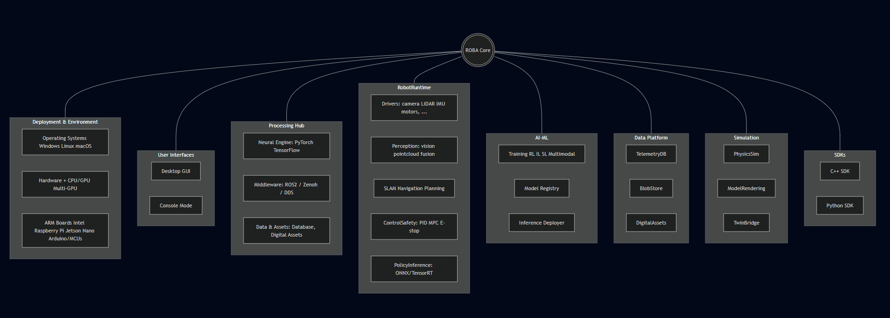

# Architecture Overview

The ROBA system supports:  
- Multi-hardware (ARM, Raspberry Pi, Jetson Nano, Arduino)  
- Multi-OS (Windows, Linux, macOS)  
- Headless & full desktop deployment  
- Blockchain-secured backbone
